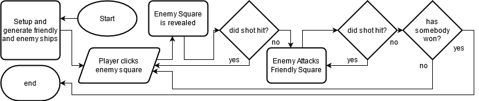

# BattleShip

## Introduction

I have been given the task of creating either **Battleship** or **Hangman** in a programming language of my choice.

I decided to create **battleship** as i saw it as more of a challenge to myself than **hangman**

> (I could easily think of a way to create hangman whereas battleship took more brainpower).

This is a _simple_ **BattleShip** game created in ~~JavaScript~~ **Java** for a college project that allows you to play against ~~another player~~ a computer.

> (note: would have liked to develop in javascript but college systems don't allow the use of node, npm or yarn, or websockets)

> (also note: by simple i mean that it's probably a really bad way of programming this but i didn't know any better)

## How to play **BattleShip**

**Battleship** is a game played by two players in which each player has a grid on which they can place 5 **ships** of varying lengths:

- 5 spaces - Carrier
- 4 spaces - Battleship
- 3 spaces - Submarine
- 3 spaces - Cruiser
- 2 spaces - Destroyer

The ships can **not** be placed next to each other or at diagonals, and **must** all be placed on the board.

Players can **not** see each others grids and take turns firing shots at each other by calling out grid references, the other player then reveals whether the shot hit or missed.

If a player hits a shot they get another go.


## Design 1:

### Example enemy grid


### Example friendly grid


The above images are a rough depiction of how the ships will be displayed to the user, using a color key to represent different states:

- **light grey** - not hit yet
- **dark grey** - shot missed
- **orange** - hit but not sunk
- **red** - sunk ship
- **blue** - friendly ship

> (note: on the friendly grid hit ships are displayed as red as it looks nicer and the player can determine whether a ship has been sunk by looking at the board.)

The window will look like this:


This is the prefered of the designs that i created. It had ups and downs in feedback such as:

```diff
+ simple
+ clean aesthetic
+ aesthetic consistent with many other windows applications
+ very intuitive
+ established layout
+ resizable window

- simple
- no features other than playing the game (new game, save, etc...)
- bland colors
- not completely accessible for color blind or those that cannot use a mouse.
```

This design was by far the most universally understood by the 4 candidates that i had asked, i also asked them to judge versions with different colors and styles but most agreed this was the most "windows" look which they said they preffered.

Although the application is built in **Java** with **Swing** instead of using the **"Nimbus"** theme it makes use of the **"Windows"** theme. Whilst maintaining Nimbus as a fallback for use on linux/macOS or if the Windows LAF is corrupted.

> The application has no specific reason that it wouldn't work on macOS or linux, so should work although i have not tested it.

These designs came after a couple iterations of trying to add more functionality without real need to do so, prior versions had menus and toolbars acrost the top that were meant to contain functions for playing a new game without closing and reopening the applictaion. but this was removed for simplicity since the game loads extremely quickly even on relatively slow machines anyways.

I plan to store the board as a 2d array that contains panels which the user can interact with.



## Some key functions

The board state is to be saved in a 2d array that can be created with [this](https://github.com/AggrievedBubble/java-battleship/blob/e2cd4baedeaf40cc6d89bc9133deaa757b416bfb/src/battleship/BattleShipGUI.java#L140-L151) function:

```java
static boolean[][] createGrid() {
	boolean[][] grid = new boolean[8][8];
	for (int x = 0; x < grid.length; x++) {
		for (int y = 0; y< grid.length; y++) {
			grid[x][y] = false;
		}
	}
	return grid;
}
```

It creates and returns the structure to be filled with ship segments that can be present or not.

Another useful function is [this](https://github.com/AggrievedBubble/java-battleship/blob/4c7634908deb38c388f5f10a8d4777b97b8d6ef1/src/battleship/BattleShipGUI.java#L153-L283) one which randomly places ships ensuring they don't overlap and are within the confines of the 8x8 grid:

```java
static boolean[][] placeShipsRandom(boolean[][] grid) {
	boolean invalid_grid = false;
	do {//repeats until a valid grid is generated where all ships are placed, none overlap or extend past the side
		if (invalid_grid) grid = generateGrid();
		invalid_grid = false;
		//placing 5 long ship
		//decides whether to place vertical or horizontal
		if ((int)Math.round(Math.random()) == 0) {
			//code for vertical placement
			int startx = (int)Math.floor(Math.random()*8);
			int starty = (int)Math.floor(Math.random()*3);
			grid[starty][startx] = true;
			grid[starty+1][startx] = true;
			grid[starty+2][startx] = true;
			grid[starty+3][startx] = true;
			grid[starty+4][startx] = true;

		} else {
			//code for horizontal placement
			int startx = (int)Math.floor(Math.random()*3);
			int starty = (int)Math.floor(Math.random()*8);
			grid[starty][startx] = true;
			grid[starty][startx+1] = true;
			grid[starty][startx+2] = true;
			grid[starty][startx+3] = true;
			grid[starty][startx+4] = true;
		}
		//placing 4 long ship
		//decides whether to place vertical or horizontal
		if ((int)Math.round(Math.random()) == 0) {
			//code for vertical
			int startx = (int)Math.floor(Math.random()*8);
			int starty = (int)Math.floor(Math.random()*4);
			if (grid[starty][startx]) invalid_grid = true;
			if (grid[starty+1][startx]) invalid_grid = true;
			if (grid[starty+2][startx]) invalid_grid = true;
			if (grid[starty+3][startx]) invalid_grid = true;
			grid[starty][startx] = true;
			grid[starty+1][startx] = true;
			grid[starty+2][startx] = true;
			grid[starty+3][startx] = true;

		} else {
			//code for horizontal
			int startx = (int)Math.floor(Math.random()*4);
			int starty = (int)Math.floor(Math.random()*8);
			if (grid[starty][startx]) invalid_grid = true;
			if (grid[starty][startx+1]) invalid_grid = true;
			if (grid[starty][startx+2]) invalid_grid = true;
			if (grid[starty][startx+3]) invalid_grid = true;
			grid[starty][startx] = true;
			grid[starty][startx+1] = true;
			grid[starty][startx+2] = true;
			grid[starty][startx+3] = true;
		}
		...
```

[continue reading PlaceShipsRandom() in BattleShipGUI.java](https://github.com/AggrievedBubble/java-battleship/blob/4c7634908deb38c388f5f10a8d4777b97b8d6ef1/src/battleship/BattleShipGUI.java#L153-L283)

One downfall of this function is that it **only** checks for overlapping ships and not contacting ships. this can lead to some strange but interesting generation. it would be fairly easy to alter this to check for contact with other ships but this is still better than having preset locations for the enemy ships that can be memorised over time and helps to improve the replayability of the game.

[This](https://github.com/AggrievedBubble/java-battleship/blob/e2cd4baedeaf40cc6d89bc9133deaa757b416bfb/src/battleship/BattleShipGUI.java#L285-L294) is an important function and is usefull for quickly logging the board state to console when debugging:

```java
static void logGrid(boolean[][] grid) {
	System.out.println("----------------");
	for (int x = 0; x < grid.length; x++) {
		System.out.print("|");
		for (int y = 0; y < grid.length; y++) {
			System.out.print(grid[x][y] + "|");
		}
		System.out.print("\n----------------\n");
	}
}
```

Another important function is the [CPUHit()](https://github.com/AggrievedBubble/java-battleship/blob/e2cd4baedeaf40cc6d89bc9133deaa757b416bfb/src/battleship/Team.java#L19-L37) function.

The CPUHit() function is called on the _FRIENDLY_ team in order to randomly attack one of the players squares. It doesn't include any logic to attack where there is likely a ship, and this is one of it's downfalls, but it doesn't attack somewhere it has already attacked:

```java
@Override
public void CPUHit() {
	int x = (int)Math.floor(Math.random()*8);
	int y = (int)Math.floor(Math.random()*8);
	for (Component comp: this.getDisplayGrid().getComponents()) {
		Segment seg = (Segment) comp;
		if (seg.getPos().getX() == x && seg.getPos().getY() == y) {
			if (seg.getState().equals(State.UNKNOWN)) {
				seg.setState(State.MISS);
			} else if (seg.getState().equals(State.ALIVE)) {
				seg.setState(State.DEAD);
			} else {
				this.CPUHit();
			}

		}
	}

}
```

## Testing

| No. | Test Type | Test Input                       | Test Reason                                        | Expected Outcome                         | Actual Outcome                           | Pass/Fail |
| --: | :-------: | :------------------------------- | :------------------------------------------------- | :--------------------------------------- | :--------------------------------------- | :-------: |
|   1 |   Valid   | Starting the application         | Test if application starts                         | Application starts                       | Application Starts                       |   Pass    |
|   2 |   Valid   | Try shooting enemy square        | Check for enemy response shot                      | Enemy shoots back                        | Enemy Shoots back                        |   Pass    |
|   3 |   Valid   | Try shooting enemy square        | Check for hit detection                            | Hits are registered and misses miss      | Hits are registered and misses miss      |   Pass    |
|   4 |   Valid   | Shoot all enemy squares          | Check enemy generation                             | All enemy ships generate non-overlapping | All enemy ships generate non-overlapping |   Pass    |
|   5 |  Invalid  | Try shooting already shot square | Check if it will shoot where has already been shot | Will not shoot                           | Doesn't shoot                            |   Pass    |
|   6 |   Valid   | Try closing the application      | Test if the JVM fully shuts down                   | JVM stops                                | JVM stops                                |   Pass    |
|   7 |  Invalid  | Click elsewhere in the window    | Test if shot will fire on background space         | Nothing happens                          | Nothing happens                          |   Pass    |
|   8 |   Valid   | Resize window                    | Test window resize                                 | Window resizes, grids resize to fill     | Window resizes, grids resize to fill     |   Pass    |

## Code Optimisations

The first code optimisation i made was changing the use of lots of if else statements to the use of switches, this helps to improve readibility and performance. another change that was made is the change to use enums to represent visual states of the segments.

Originally the application could randomly select from a number of positions for the enemy ships but the time it took to write out lots of different combinations so that it wasn't repetitive would have been too long. So instead I created a function to randomly generate the ships. The function doesn't yet check for contact between ships but could be easily rewritten to do so.

Another change made was that I went from storing the location as an array of ints to being objects of a position class. This improves readablility, and maintainability since the code self-documents more than before

Instead of `this.getPosition()[0];`, `this.getPosition()[1];` it now looks like: `this.getPos().getX();` and `this.getPos().getY();` which is an improvement in readability and ensures someone can understand this code without needing to know that `[0]` is the x position and `[1]` is the y position.

## Evaluation

Throughout the task to create Battleship I have tried to create a maintainable, improvable framework that could be adapted into numerous other grid based games. Whilst still managing to be a simple way to play Battleship.

The solution I created is reasonably elegant solution and generates a random grid for the enemy. It automatically and randomly attacks if you miss, the final product is developed in a relatively modular style which allows for quick and easy modifications whith easier maintainance.

I would argue that I have met the requirements for the project.

Overall my solution worked well, there are some things I would have liked to added that would have completed the experience such as checks for contacting ships, sink detection and options to play against other people.

It would have also been nice to be able to use a newer framework than swing such as javafx. but unfortunately I don't have knowledge of that. I would have also prefered to use web technologies such as javascript, html and css, this would enable the game to be played in a web browser by navigating to a website or using electron to make it a desktop app.

Using javascript would have also enabled easier multiplayer through websockets and the use of [socket.io](https://socket.io/)

> After creating this document i noticed a bug in which the player can shoot their own ships... the computer then also takes a shot at the players ships. this is not intended and could be fixed easily by adding a simple if statement arround the switch [here](https://github.com/AggrievedBubble/java-battleship/blob/4c7634908deb38c388f5f10a8d4777b97b8d6ef1/src/battleship/ship/Segment.java#L94-L108)
